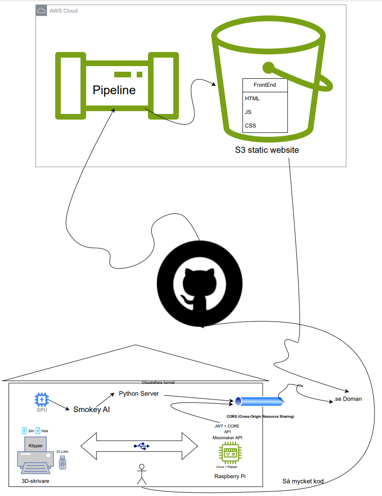

# Cloud Print Project

## Introduction:

Initiating a 3D print on an older 3D printer requires several steps: saving the 3D file to an SD card, inserting the card into the printer, adjusting settings on the built-in screen, monitoring the print manually, and awaiting completion.

The project aims to develop and implement a wireless solution for 3D printers, enabling remote monitoring and control of the printing process through an intuitive user interface. By leveraging modern technologies such as Raspberry Pi, Python, AWS (Amazon Web Services), and Cloudflare, the project aims to enhance the user experience and efficiency of 3D printers.

The benefits of the proposed solution include the ability to wirelessly send files to the printer via WiFi, monitor the printing process via a webcam, calibrate the printer wirelessly, increase printing speed by up to 70% using techniques like "Input shaping", improve print quality considering Raspberry Pi's CPU and RAM, and the ability to interact with AI for advice and tips regarding 3D printing.

## Target Audience:

This application targets all owners and users of 3D printers, regardless of experience level, with the aim of making 3D printing easier, faster, and more convenient by integrating modern technologies and smart solutions.
The app's target audience includes hobbyists exploring 3D printing as a creative hobby, professionals using 3D printers for prototypes and manufacturing, as well as teachers and students utilizing the technology for educational purposes.
For users who already have Klipper installed on their 3D printer, or where installation can be easily done via an SD card, they do not need to undergo a motherboard flashing. This simple installation process is particularly advantageous for those who already have Klipper preinstalled or for printers where installation can be done with a simple SD card. For users with older printers or those requiring a more extensive installation, an alternative method will be described later.

## How It Works:

Visitors can open the web page in their browser and thereby access the option to add a printer by simply entering its IP address. After this step, the user is given the option to either log in if they already have an account or register if they are new users. Then, the user is presented with an overview of all temperature sensors and relevant information about the printer, including its connection status and actions to be taken in case of any connection issues. For users needing further assistance, there is the option to interact with Smokey the AI, where all questions can be asked and answered. More detailed information about Smokey will be provided later.

## First Connection: 3D Printer to Raspberry Pi.

### Configuring the 3D Printer with Klipper:

To enhance the functionality and performance of the 3D printer, I chose to integrate it with a Raspberry Pi, providing it with an increased level of intelligence and functionality. This can be likened to adding an intelligent central unit to the printer, enabling communication with other devices such as computers or smartphones. The decision to integrate Raspberry Pi is based on my interest in using sophisticated software called Klipper, aimed at improving the printer's speed and precision.

To implement Klipper on the printer, the following actions were taken:

1. **Preparation of tools and software:** The initiation began with downloading the Klipper software and ensuring access to necessary tools such as an STLink and various cables.

2. **Physical connection of STLink to the printer's circuit board:** I proceeded by physically connecting STLink to the printer's circuit board using appropriate cables, enabling communication between the printer and my computer.

3. **Creation of binary and hex files for Klipper:** Before implementing Klipper, it was necessary to generate files compatible with the printer's hardware and software.

   a. *Compiling Klipper for the specific 3D printer:* I navigated to the location of Klipper code via the terminal and used the command `make menuconfig` to configure Klipper according to the printer's specifications.

   b. *Configuring Klipper for the printer:* The settings in Klipper's configuration interface were adjusted to match the printer's requirements and features.

   c. *Compiling Klipper:* After the settings were correct, the command `make` was used to compile Klipper and prepare it for use with the printer.

   d. *Creating a hex file for firmware flashing:* Using the `scripts/klipper_mcu_install.py` tool, a specific hex file required for making the printer intelligent was generated.

4. **Transferring files to the printer's circuit board with TPLINK and USB flashing:** The printer's circuit board was connected to my computer using a USB cable, and the TPLINK application was used to smoothly transfer the previously created files.

5. **Flashing firmware on the control unit with USB flashing:** Finally, an update of the printer's firmware was performed with the generated hex file, enabling the printer to take advantage of Klipper's advanced features and benefits.

### Configuring Raspberry Pi with Klipper:

After the 3D printer has been connected to Raspberry Pi and Klipper installed, the next step was to ensure smooth integration. The following steps were taken:

1. **Preparation of tools and software:** Raspberry Pi was updated to the latest software version, and an internet connection was ensured.

2. **Installation of additional software:** To enable efficient communication between Raspberry Pi and the 3D printer through Klipper, additional programs were installed, including Moonraker.

3. **Configuration of Klipper:** The configuration file for Klipper on Raspberry Pi was adjusted according to the 3D printer's requirements, including adjustments related to stepper motors' movements and temperature measurement.

4. **Testing and troubleshooting:** All settings were carefully tested to ensure correct functionality and avoid any inaccuracies or collisions.

Now, there is a Klipper server with several useful endpoints available on localhost. By sending requests to Klipper's endpoints using the Postman tool, motors can be controlled, and sensors can be monitored. It is satisfying to have such a degree of control over the process.

## Second Connection: Klipper API to Cloud:

Here, there were quite significant changes in the plan. Originally, I considered creating a site-to-site connection in AWS. This involved using the following services on AWS:

- EC2 (hourly cost)
- VPC (Virtual Private Cloud) (monthly cost)
- Customer Gateway (Free)
- VPN connection (I considered OpenSwan) (Free open-source)
- Site-to-Site connection (data transfer costs).

The costs were high, and AWS data transfer is relatively expensive, exceeding the project's budget, which aims to develop a cost-effective and entertaining solution.

Instead, I chose to use Cloudflare, which is free but requires a domain that I could purchase for only 7 kr per year.

The plan here is to create a secure connection to my printer that I can access outside my private home network. Cloudflare offers such a service for free, and the following steps will be described step by step.

### Creating a Cloudflare Tunnel:

A terminal window was opened on the computer, and navigation was done to the location where the Cloudflare CLI tool was installed. Then, the command `cloudflared tunnel create` was used to generate a new tunnel, followed by following the on-screen instructions to specify the tunnel's name and configuration.

After the tunnel was created, it was initiated with the command `cloudflared tunnel run <tunnel name>`. This action allows...

